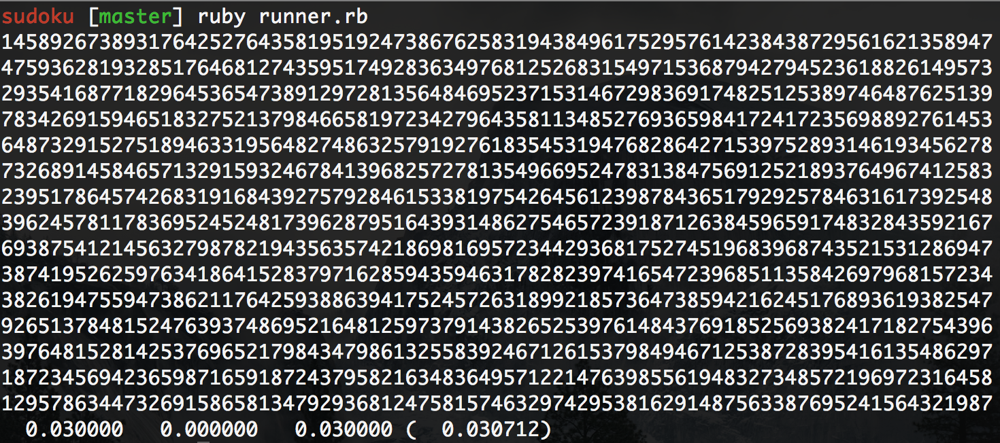

# sudoku

During one week of Dev Bootcamp, I became obsessed with the idea that I could make a faster solution to the sudoku challenge. I made a couple solutions, this is my fastest one. This is insane, because it isn't what ruby is for, but here it is anyway.

To run the original 15 puzzles, just run `ruby runner.rb`. Modify the range in runner if you want to run the 16th puzzle ('the hardest puzzle' by some finnish mathematician) or a different combination of puzzles. The solved strings will print to the terminal and a benchmark will also print.

The current runtime for the 15 puzzles.
